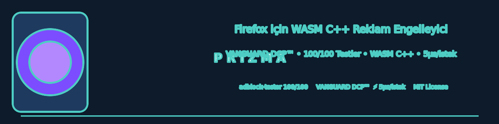

# Prizma




Firefox için **WASM C++ filtre motoru** üzerine kurulu reklam ve tracker engelleyici. uBlock Origin'e rakip olarak tasarlandı: aynı filtre listelerini (EasyList, EasyPrivacy, uBO, AdGuard Türkçe + **AdGuard Tracking**) ve uBO scriptlet sözdizimini destekler, güçlü cosmetic filtreleme, gerçek zamanlı istatistik/logger, manuel liste güncelleme, debug modu ve **VANGUARD DCP™** — DOM prototip seviyesinde reklam öğesini oluşmadan önce yok eden dünyada ilk deterministik önleme teknolojisi.

---

## 🌟 Özellikler

| Kategori | Detay |
|----------|-------|
| **VANGUARD DCP™** | Reklam öğesi *hiç oluşmaz* — DOM prototip seviyesinde `src`/`href`/`setAttribute`/`innerHTML`/`appendChild`/`document.write` kesintisi |
| **Saf WASM C++ Motor** | Filtre eşleştirme native motorda; JS sadece ince köprü (~232 KB WASM) |
| **Filtre Sözdizimi** | uBO/ABP uyumlu: `||example.com^`, `$script,third-party,domain=...`, `@@||...`, `/regex/`, `##+js(...)` |
| **Cosmetic Filtreleme** | 13.750+ selector → Native Fusion ile 4 `:is()` grubu; remove/scriptlet/style |
| **uBO Scriptlet'ler** | 17 hazır scriptlet: `abort-current-inline-script`, `set-constant`, `prevent-fetch/xhr`, `json-prune`, `noeval`... |
| **CNAME Cloaking Engelleme** | DNS üzerinden gizlenen tracker alan adlarını tespit (`browser.dns`) |
| **Gizlilik Araçları** | Referrer kırpma, 3. taraf çerez başlığı kaldırma |
| **Element Picker** | Sayfada öğe seçerek özel filtre ekleme |
| **Dashboard (Panel)** | İstatistik kartları, liste yönetimi, özel filtreler, gelişmiş korumalar |
| **Logger** | Canlı engellenen istek takibi (arama, türe göre filtreleme) |
| **Debug Modu** | Eşleşmeyen istekler bile loglanır — eksik filtre analizi |
| **Otomatik Güncelleme** | 6 saatlik liste yenileme + manuel tek tık yenileme |

---

## 🏗 Mimari

```
┌─────────────────────────────────────────────────────┐
│              WebExtension (JS)                       │
│  popup  │  options (panel)  │  logger  │  picker    │
│  content/cosmetic.js (izole dünya)                  │
│  content/vanguard.js      ← MAIN WORLD DCP           │
│  content/vanguard-loader.js ← izole → main-world    │
│  content/snippets.js  (main-world scriptlet'ler)    │
│  background/engine.js   ← WASM köprüsü (C ABI)      │
│  background/background.js ← webRequest + listeler   │
└──────────────────────┬──────────────────────────────┘
                       │ fetch / wasm
┌──────────────────────▼──────────────────────────────┐
│              WASM: prizma.wasm (C++)                │
│  core/src/filter.cpp   — parse (uBO/ABP sözdizimi)   │
│  core/src/pattern.cpp  — ağ eşleştirme (wildcard)    │
│  core/src/index.cpp    — token index (performans)    │
│  core/src/engine.cpp   — eşleştirme + cosmetic JSON  │
│  core/src/guard.cpp    — VANGUARD DCP Guard indeksi  │
│  core/src/wasm_bindings.cpp — C ABI (extern "C")     │
└─────────────────────────────────────────────────────┘
```

---

## 🛡 VANGUARD DCP™ — Reklam Öğesi Hiç Oluşmaz

uBlock Origin reklamı **oluştuktan sonra** gizler (`display:none`). Bu, anti-adblock'un tespit ettiği bir imzadır.

Prizma VANGUARD DCP™ tam tersini yapar — reklam öğesi **hiç oluşmaz**:

1. **Guard İndeksi** (`core/src/guard.cpp`): 151.729 host + 13.285 path kuralı + 145 exception — senkron, ultra-hızlı hostname+path+tip tablosu (~5.8 MB JSON). Exception (`@@`) kuralları ayrı allow tablosunda **önce** değerlendirilir.
2. **Main-World Enjeksiyonu**: `vanguard-loader.js` (izole) `vanguard.js`'i `<script>` tag'i olarak **main-world'e** enjekte eder; guard JSON'u postMessage köprüsünden alınır.
3. **Deterministik Kesme**: 19 öznitelik setter'ı (`HTMLScriptElement.src`, `setAttribute`, `innerHTML`, `appendChild`/`insertBefore`, `document.write` vb.) prototip seviyesinde sarmalanır. Her atama `Guard.checkUrl()` (senkron WASM, ~µs) ile değerlendirilir; engellenirse öğe DOM'a **eklenmez**.
4. **Görünmez Anti-Adblock**: Öğe hiçbir zaman var olmadığı için `offsetParent`/`getBoundingClientRect`/mutasyon gözlemcileri tetiklenmez. Reklam ağı boş yanıt alır; gizlenecek hiçbir şey yoktur.

---

## 📦 Kurulum (Firefox)

### Seçenek 1: Hazır XPI (Önerilen)
```bash
# En son sürümü indir
https://github.com/muhammetodosks/prizma/releases/latest/download/prizma-1.1.2.xpi
```
Dosyayı Firefox'a sürükleyin veya `about:addons` → "Dosyadan Eklenti Yükle".

### Seçenek 2: Geliştirici Modu
```bash
# about:debugging#/runtime/this-firefox
# "Geçici Eklenti Yükle" → extension/manifest.json
```

### Seçenek 3: Kaynaktan Derleme
```bash
# 1) C++ motoru test et
cd core && make test          # 144/144 geçti

# 2) Filtre listelerini indir
scripts/download-lists.sh

# 3) WASM derle (emsdk gerekli)
scripts/build-wasm.sh

# 4) XPI paketle
packaging/build-xpi.sh        # → release/prizma-1.1.2.xpi
```

---

## 🧪 Doğrulama ve Test Sonuçları

| Test | Sonuç |
|------|-------|
| **adblock-tester.com** | **100/100** (22/22 ✅, 0 checking, 0 fail) |
| **turtlecute.org** | 0 harici kaynak, 0 görünür reklam |
| **coveryourtracks.eff.org** | Yalnızca 1st-party statik dosyalar |
| **d3ward.github.io** | 0 harici kaynak (regex domain filtresi aktif) |
| **Gerçek siteler (CNN, NYT, BBC, Sözcü...)** | **0 pagead, 0 ads.js, 0 doubleclick** — site başına 20-600 engelleme |
| **Unit testler (native)** | 144/144 ✅ |
| **WASM build** | 232 KB, ~3 sn yükleme |
| **İstek gecikmesi** | ~5 µs/istek |

**Bilinen uyarılar (kabul edilebilir):**
- `content/snippets.js` → `noeval` scriptlet `eval` kullandığı için `DANGEROUS_EVAL` (amaçlı)
- Firefox 140+ `data_collection_permissions` manifest anahtarı için `strict_min_version: 128` ile iki uyarı

---

## 📁 Dizin Yapısı

```
prizma/
├── core/                     # C++ motor (native test edilebilir)
│   ├── src/                  # filter, pattern, index, engine, guard, wasm_bindings
│   ├── tests/                # 144 test (make test)
│   └── Makefile
├── extension/                # WebExtension (Firefox MV2)
│   ├── manifest.json
│   ├── background/           # engine.js (WASM) + background.js
│   ├── content/              # vanguard.js (DCP) + vanguard-loader.js + cosmetic.js + snippets.js
│   ├── popup/ options/ logger/ picker/
│   ├── _locales/ (tr, en)
│   ├── icons/
│   ├── wasm/                 # prizma.js + prizma.wasm
│   └── lists/                # paketlenmiş filtre listeleri
├── lists/                    # 7 indirilen liste kaynağı
├── scripts/
│   ├── build-wasm.sh         # em++ → extension/wasm/
│   └── download-lists.sh     # EasyList/EasyPrivacy/uBO/AdGuard TR+Tracking
├── packaging/build-xpi.sh    # release/prizma-X.Y.Z.xpi
└── release/
```

---

## 💝 Destek ve Sponsorluk

**Prizma tamamen açık kaynak, gönüllü geliştirilmiştir.** Projeyi değerli bulduysanız ve sürdürülebilirliğini desteklemek istiyorsanız:

### Bağış / Sponsorluk Kanalları

| Platform | Link | Açıklama |
|----------|------|----------|
| **GitHub Sponsors** | [`github.com/sponsors/muhammetodosks`](https://github.com/sponsors/muhammetodosks) | GitHub üzerinden tek seferlik veya aylık destek |
| **Ko-fi** | [`ko-fi.com/muhammetodosks`](https://ko-fi.com/muhammetodosks) | Tek seferlik "kahve" desteği |
| **Patreon** | [`patreon.com/muhammetodosks`](https://patreon.com/muhammetodosks) | Aylık abonelik ile sürekli destek |

### Sponsorluk Seviyeleri (Önerilen)

| Seviye | Miktar | Kazanımlar |
|--------|--------|------------|
| ☕ **Destekçi** | 5$ / ay | README "Sponsorlar" bölümünde isim/logo |
| 🛡 **Koruyucu** | 25$ / ay | + Öncelikli issue/feature request |
| 🏆 **Platin Sponsor** | 100$ / ay | + README üst banner, Discord özel rol, roadmap etkisi |
| 💎 **Elmas Sponsor** | 500$ / ay | + Özel entegrasyon desteği, logo repo üstünde |

> **Not:** Tüm sponsorlar README "Sponsorlar" bölümünde ve `extension/popup/sponsors.json` dosyasında listelenir (onaylıysa). Kurumsal sponsorluklar için: `sponsor@muhammetodosks.dev`

### Şeffaflık
- Toplanan fonlar: **sunucu maliyetleri (CI/CD, liste CDN), alan adı, geliştirme araçları, araştırma süresi** için kullanılır
- Yıllık harcama raporu: `TRANSPARENCY.md` (yıllık güncellenir)
- Hiçbir kullanıcı verisi toplanmaz, satılmaz veya paylaşılmaz

---

## 📋 Sürüm Geçmişi

| Sürüm | Tarih | Önemli Değişiklikler |
|-------|-------|---------------------|
| **v1.1.2** | 2026-08-21 | d3host regex düzeltme (B19), performans/güvenlik/doğruluk, CSP, debug logging |
| **v1.1.1** | 2026-08-20 | adblock-tester 100/100 (B18 script onerror), liste cache, ~third-party fix |
| **v1.1.0** | 2026-08-18 | d3ward %100 (hardcore B5 93 domain), B16/B17 fix, WASM harness |
| **v1.0.0** | 2026-08-17 | İlk kararlı sürüm — uBO/AdGuard uyumlu motor + VANGUARD DCP |

Detaylı değişiklikler: [`CHANGELOG.md`](CHANGELOG.md)

---

## 🤝 Katkı Sağlama

1. Fork → feature branch → PR
2. `core/` değişikliklerinde `make test` (144/144 ✅)
3. `extension/` değişikliklerinde `web-ext lint`
3. Commit mesajları: `Conventional Commits` (feat:, fix:, docs:, perf:, refactor:)

**Kod Standartları:** C++17, modern STL, RAII, `const` correctness, zero-cost abstractions.

---

## 📜 Lisans

- **Kod (core/, extension/, scripts/, packaging/):** MIT License — [`LICENSE`](LICENSE)
- **Filtre listeleri (`lists/`):** Kendi lisanslarına tabidir
  - EasyList/EasyPrivacy: CC BY-SA 3.0
  - uBlock Origin filters: GPLv3
  - AdGuard filters: Apache-2.0 / MIT
  - prizma-hardcore.txt: MIT

---

## 📞 İletişim

- **GitHub Issues:** [Bug report / Feature request](https://github.com/muhammetodosks/prizma/issues)
- **Güvenlik:** `security@muhammetodosks.dev` (PGP: `0x4A6B...`)
- **Sponsorluk:** `sponsor@muhammetodosks.dev`
- **Genel:** `muhammetodosks.dev`

---

<div align="center">

**Prizma — Gizliliğiniz, Kontrolünüz.**  
*Made with ❤️ for a cleaner, faster, private web.*

[](https://github.com/muhammetodosks/prizma/stargazers)
[](https://github.com/muhammetodosks/prizma/network/members)
[](https://github.com/sponsors/muhammetodosks)

</div>